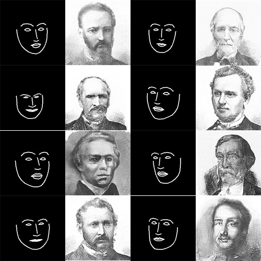
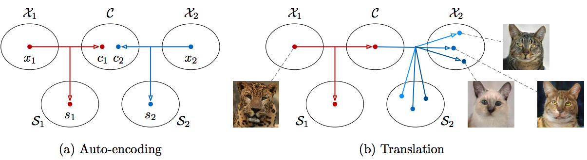
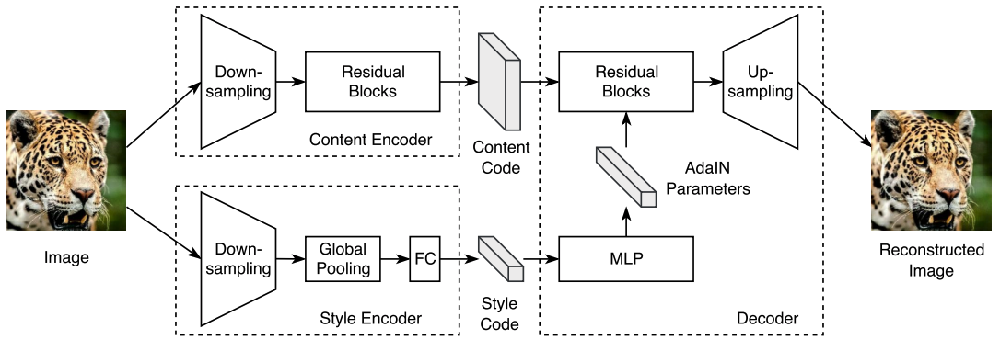
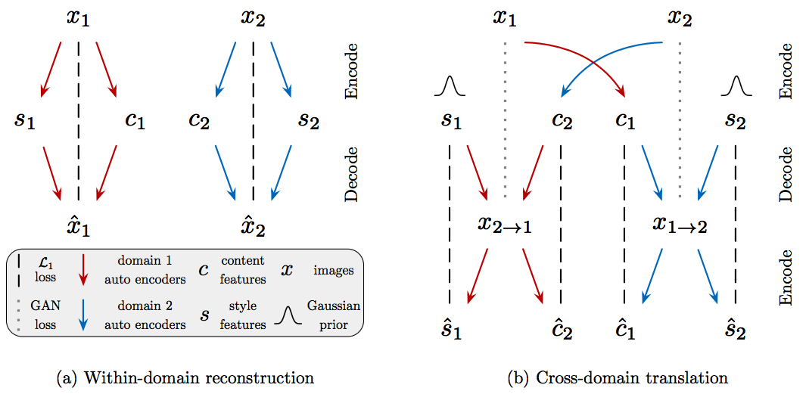
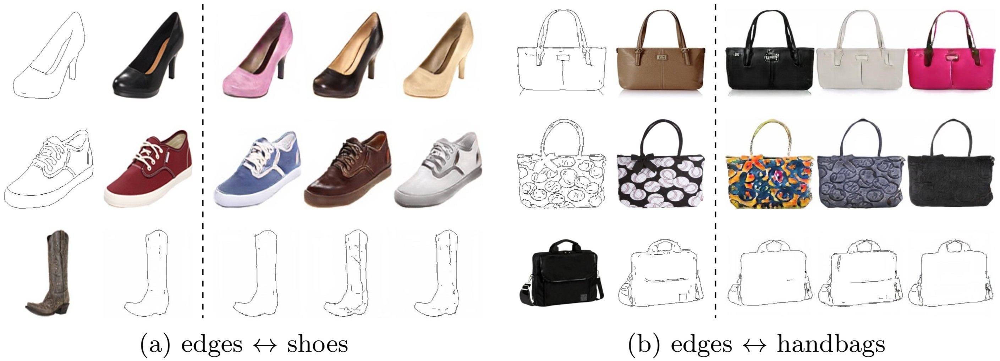
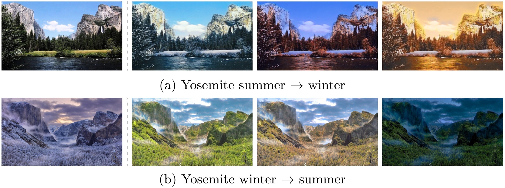

# edges2portrait
Edges to portrait image-to-image translation using MUNIT

Inspired from [Mario Klingemann's work](https://twitter.com/quasimondo/status/826065030944870400)



## Pretrained Model

[Download](https://drive.google.com/drive/folders/1GQd0pv1j3oCZelj2k2jIyUKc5Amu9Kik?usp=sharing)

```
./checkpoint/MUNIT_edges2portrait_lsgan/checkpoint
./checkpoint/MUNIT_edges2portrait_lsgan/MUNIT.model-1000001.data-00000-of-00001
./checkpoint/MUNIT_edges2portrait_lsgan/MUNIT.model-1000001.index
./checkpoint/MUNIT_edges2portrait_lsgan/MUNIT.model-1000001.meta
```

## Realtime Sketch to Portrait
```
python main.py --phase opencv --dataset edges2portrait --batch_size 1 --num_style 3
```

## Dataset

Grabbed from https://www.flickr.com/search/?text=portrait%20%20bldigital

[Download preprocessed dataset](https://www.kaggle.com/kairess/edges2portrait/)


# MUNIT-Tensorflow
Simple Tensorflow implementation of ["Multimodal Unsupervised Image-to-Image Translation"](https://arxiv.org/abs/1804.04732)

## Requirements
* Tensorflow 1.4
* Python 3.6

## Issue
* Author uses so many iterations (1M = 1,000,000)
* Author uses LSGAN, but do not multiply each of G and D by 0.5

## Usage
```
├── dataset
   └── YOUR_DATASET_NAME
       ├── trainA
           ├── xxx.jpg (name, format doesn't matter)
           ├── yyy.png
           └── ...
       ├── trainB
           ├── zzz.jpg
           ├── www.png
           └── ...
       ├── testA
           ├── aaa.jpg 
           ├── bbb.png
           └── ...
       └── testB
           ├── ccc.jpg 
           ├── ddd.png
           └── ...
           
├── guide.jpg (example for guided image translation task)
```

### Train
* python main.py --phase train --dataset summer2winter --batch_size 1

### Test
* python main.py --phase test --dataset summer2winter --batch_size 1 --num_style 3

### Guided Image Translation
* python main.py --phase guide --dataset summer2winter --batch_size 1 --direction a2b --guide_img guide.jpg

## Summary


## Architecture 


## Model Overview


## Results
### Edges to Shoes/handbags Translation


### Animal Image Translation


### Street Scene Translation


### Yosemite Summer to Winter Translation (HD)


### Example-guided Image Translation


## Related works
* [CycleGAN-Tensorflow](https://github.com/taki0112/CycleGAN-Tensorflow)
* [DiscoGAN-Tensorflow](https://github.com/taki0112/DiscoGAN-Tensorflow)
* [UNIT-Tensorflow](https://github.com/taki0112/UNIT-Tensorflow)
* [StarGAN-Tensorflow](https://github.com/taki0112/StarGAN-Tensorflow)
* [DRIT-Tensorflow](https://github.com/taki0112/DRIT-Tensorflow)

## Reference
* [MUNIT-Pytorch](https://github.com/NVlabs/MUNIT) (Author implementation)

## Author
Junho Kim
